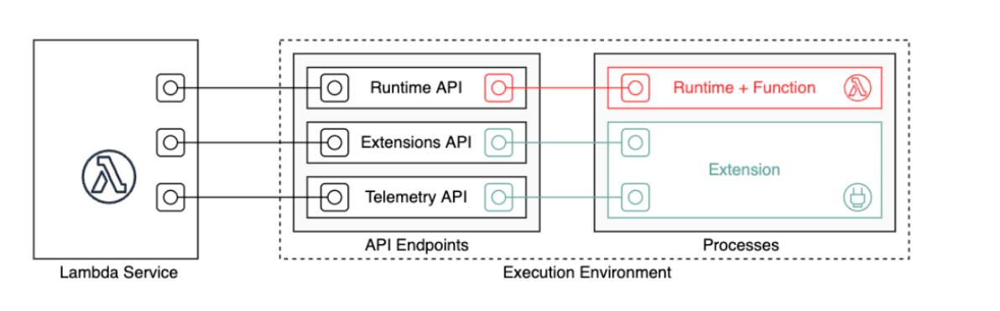

# AWS Lambda

## Severless

- serverless is a new paradigm in which developes do not manage servers.
- code is deployed and functions are deployed
- Initially serverless == FaaS (Function as a service)
- Serverless was pionered by AWS lambda but now it also includes:
   - AWS Lambda
   - DynamoDB
   - AWS Cognito
   - API gateway
   - S3
   - SNS & SQS
   - Kenisis Data Firehose
   - Aurora Serverless
   - Step Functions
   - Fargate
- Severless doesnt mean there are no servers. It mean you just donot mange/provision/see the servers.

## Lambda

Comparision on EC2 vs Lambda:

**EC2** :

- Virtual servers in the cloud
- Limited by RAM and CPU
- Continiously running
- Scaling means intervention to add/remove servers.

**Lambda** :

- Virtual functions - no servers to manage
- Limited by time - short executions
- Run on-demend
- scaling is automated

**Benifits of Lambda:**

- Easy Pricing:
  - pay per requesr and compute
  - free tier 1M AWS lambda requests. `$0.20` per 1 million requests after exeeding the free tier(`$0.0000002` per request).
  - 400K GBs of compute time is free ie(400000 s if function is 1 GB RAM). $1.00 for 600,000 GB seconds.
- Integrated with the AWS suite of services(API gateway, Kenesis, DynamoDB, S3, CloudFront, CloudWatch Events EventBridge CloudWatch Logs, SNS, SQS, Cognito).
- Integrated with many programming languages:
   - Node.js
   - Python
   - java (Java8 compatible)
   - C#
   - GoLang
   - C#
   - Ruby
   - Custom Runtime API (community supported, example rust)
   - Lambda Container image (must implement the lambda runtime API )
       - ECS/Fargate is preferred for running arbitary Docker images 
- Monitoring throug AWS CloudWatch.
- more resources per function(uo to 10GB of RAM)
- increasing RAM will also improve CPU and network 


### Synchronous Invocations 

Synchronous: CLI, SDK, API Gateway, ALB, ELB, Cloud Front, S3 batch, Cognito, step functions etc.(results are returned and errors are handled from client side)  ex: Client --> API Gateway --> Lambda.

AWS CLI Invocation:

```


# LINUX / MAC
aws lambda invoke --function-name demo-lambda --cli-binary-format raw-in-base64-out --payload '{"key1": "value1", "key2": "value2", "key3": "value3" }' --region us-east-1 response.json
```
```
# WINDOWS POWERSHELL
aws lambda invoke --function-name demo-lambda --cli-binary-format raw-in-base64-out --payload '{\"key1\": \"value1\", \"key2\": \"value2\", \"key3\": \"value3\" }' --region us-east-1 response.json
```
```
# WINDOWS CMD
aws lambda invoke --function-name demo-lambda --cli-binary-format raw-in-base64-out --payload "{""key1"":""value1"",""key2"":""value2"",""key3"":""value3""}" --region us-east-1 response.json
```

### Asynchronous Invocations

- S3, SNS, Cloudwatch events
- the events are placed in an Event Queue
- lambda attempts to retry on errors
  - 3 tries total
  - 1 min wait after 1st, then 2 min wait
- In case of retries make sure that the processing is idempotenet
- If the function is retries, the duplicate log entries are added to cloud watch logs
- Can define a DLQ (dead letter queue) - SNS or SQS - for failed processing (need correct permissions)
- Asynchronous invocations will speed up the processing. (if there is no waiting time for result)
- Services:
   - S3
   - SNS
   - CloudWatch Events/ EventBridge
   - CodeCommit
   - CodePipeline
   - CloudWatch Logs
   - SES
   - Cloud Formation
   - AWS config
   - AWS IOT and IOT events


```
# LINUX / MAC
aws lambda invoke --function-name demo-lambda --cli-binary-format raw-in-base64-out --payload '{"key1": "value1", "key2": "value2", "key3": "value3" }' --invocation-type Event --region us-east-1 response.json
```
```
# WINDOWS POWERSHELL
aws lambda invoke --function-name demo-lambda --cli-binary-format raw-in-base64-out --payload '{\"key1\": \"value1\", \"key2\": \"value2\", \"key3\": \"value3\" }' --invocation-type Event --region us-east-1 response.json
```
```
# WINDOWS CMD
aws lambda invoke --function-name demo-lambda --cli-binary-format raw-in-base64-out --payload "{""key1"":""value1"",""key2"":""value2"",""key3"":""value3""}" --invocation-type Event --region us-east-1 response.json

```
  
## Lambda Execution Enviorment

- Lambda invokes your function in an execution environment, which provides a secure and isolated runtime environment. 
- The execution environment manages the resources required to run your function.
-  The execution environment also provides lifecycle support for the function's runtime and any external extensions associated with your function.
-  The function's runtime communicates with Lambda using the Runtime API. Extensions communicate with Lambda using the Extensions API. Extensions can also receive log messages and other telemetry from the function by using the Telemetry API.



**Runtime API:** an HTTP API for custom runtimes to receive invocation events from Lambda and send response data back within the Lambda execution environment.

**Extentions API:**Lambda function authors use extensions to integrate Lambda with their preferred tools for monitoring, observability, security, and governance.c

**Telemetry API**: Using the Lambda Telemetry API, your extensions can directly receive telemetry data from Lambda. During function initialization and invocation, Lambda automatically captures telemetry, such as logs, platform metrics, and platform traces.

## SDK (Software development Kit)

- AWS SDK is used to perform actions n AWS directly from application code (without using CLI).
- Python SDK is boto 3, AWS CLI is written in boto 3.
- If a region is not specified or configured "us-east-1" is choosen by default.


# Function Handler (Python Handler)

- Function handler is a method in the lambda function code that processes the evnets. When the lambda function is invoded, Lambda runs the handler method. Handler method returs a response, which can be used to handle another event.

Naming:

- The name of the file in which the handler function is created.
- The name of the Python handler function

A function handler can be any name; however, the default name in the Lambda console is lambda_function.lambda_handler.

# Event and Context Objects

**Event:** Event is the data passed to the lambda function upon execution. It contains data about where its emiitied from, and the other parameters that are passed in the event.

**Context:**  context is a Python objects that implements methods and has attributes. It's main role is to provide information about the current execution environment. Unlike event, the methods and properties of the context object remain the same regardless of the lambda was invoked or triggered.


## Cloud Watch

- AWS CloudWatch is a monitoring and mangement service that collects and visualize the execution logs, metrics, and event data in automaed dashboards.