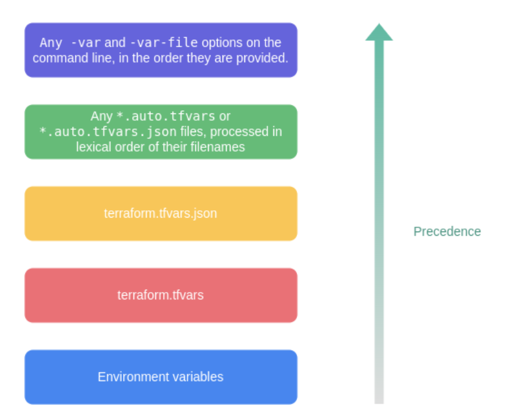

# Terraform

**IaC:** Infrastructure as Code.

- **Automation** of infrastructure
- used to maintain the **state** (compliant)
- makes the infrastructure **auditable**
  - used to keep the infrastructure change history in a version constrol system.

### Installing Terraform: 

1. download the zip file from [https://developer.hashicorp.com/terraform/downloads](https://developer.hashicorp.com/terraform/downloads)
2. extract it in a folder
3. set the path variable for the tearraform
4. run `terraforn -v` to get the terraform version and check if the terraform is installed.

#### main.tf


### Terraform HCL(HashiCorp Configuration Language)

**Argument:** An argument assigns a value to a particular name.

**Block:** A block is a container for other content:

**Identifier:** 

- Argument names, block type names, and the names of most Terraform-specific constructs like resources, input variables, etc. are all identifiers.
- Identifiers can contain letters, digits, underscores (_), and hyphens (-). The first character of an identifier must not be a digit, to avoid ambiguity with literal numbers.

**Variables:**

- Variable is decraled using variable block

```tf
variable "var-name" {
    type = type-name
    default = "default-value"
}
```

- variable must be unique among all variables in the same module.
- The name of a variable can be any valid identifier except the following: `source`, `version`, `providers`, `count`, `for_each`, `lifecycle`, `depends_on`, `locals`.

**Argumemts:**

Terraform CLI defines the following optional arguments for a variable.
- default : A default value, If present, the variable is considered to be optional and the default value will be used if no value is set when calling the module or running Terraform. The default argument requires a literal value and cannot reference other objects in the configuration.
- type : This argument specifies what value types are accepted for the variable.
   - string
   - number
   - bool
 - complex types
   - list
   - set
   - map
      - `element` retrieves a value from a list given its index.(`element(list, index)`)
      - `index` finds the element index for a given value in a list.(`index(list, value)`)
      - `lookup` retrieves the value of a single element from a map, given its key. If the given key does not exist, the given default value is returned instead. (`lookup(map, key, default)`)
   - object
   - tuple 

- description : This specifies the input variable's documentation.
- validation : A block to define validation rules, usually in addition to type constraints.
- sensitive : Limits Terraform UI output when the variable is used in configuration.
- nullable : Specify if the variable can be null within the module.

```tf
variable "image_id" {
  type        = string
  default     = "ami-0111101110" 
  description = "The id of the machine image (AMI) to use for the server."

  validation {
    condition     = length(var.image_id) > 4 && substr(var.image_id, 0, 4) == "ami-"
    error_message = "The image_id value must be a valid AMI id, starting with \"ami-\"."
  }
  sensitivie = true
  nullable = false
}
```

- variables can be assigned during the terrafrom plan `-var="var-name=value"`
- Tfvars files allow us to manage variable assignments systematically in a file with the extension .tfvars or .tfvars.json.
- Terraform auto loads tfvars files only when they are named terraform.tfvars or terraform.tfvars.json.
- any other var file can be loaded during runtime using `terraform plan -var-file="filename"`
- to auto load other file, name the file as "name.auto.tfvars"

Variable loading precedence:




#### Conditional Expressions

```
condition ? true_value :false_value
```

#### Terraform Console
 
The terraform console command provides an interactive console for evaluating expressions.

```
terraform console
```

### Terraform with AWS

1. AWS account
2. Create an IAM user

#### Provider:

#### Resource:

#### data sources:

- Data sources allow data to be fetched or computed for useing them elsewhere in terraform configuration (external data).
- Data source code 


```
data "data_source" "data_source_name" {

  filter {
    
  }
}
```

- filter can be optional based on the resource.

#### local, remote and desired state:

#### common tf commands

- init
- plan
- apply
- show
- destroy
- Validate


#### outputs

```
output outputname {

  value = 

}
```

#### tainting/updating resources

`Terraform apply -replace = resource_name` 

- alternative command for terrafom taint (used in versions below 0.15.2)

#### null resource & local execution

- null resource implements the standard resource lifecycle but takes no further action

```

resource "" "" {
  depends_on = [null_resource.name]
}

resource "null_resource" "name"{

}


```

#### string templates and Interpolation


#### terraform registry

The Terraform Registry is an interactive resource for discovering a wide selection of integrations (providers), configuration packages (modules), and security rules (policies) for use with Terraform. 

navigate to the [https://developer.hashicorp.com/terraform/registry](https://developer.hashicorp.com/terraform/registry)


#### workspaces

- Terraform allows us to have multiple workspaces, with each of the workspace we can have different set of enviormnet varialbes associated.

```
terraofrm workspace list
```

```
terraform workspace show

```

```
terraform workspace new name
```

```
terraform workspace select
```

```
terraform workspace 
```


####  Debugging

- TF_LOG = trace
- TF_LOG_PATH = file.log

#### Terraform backend

- tfstate file is stocred in the backend for collaboration

```
terraform {
  backend "s3" {

    bucket = ""
    key = ""
    region = ""

  }
}
```

## Devops and CICS

DevOps is a software development approach that combines development (Dev) and operations (Ops) teams to collaborate throughout the entire software development lifecycle (SDLC). The goal of DevOps is to streamline the development process, increase collaboration, and improve the efficiency and quality of software delivery.

Continuous Integration and Continuous Deployment (CI/CD) is a key practice within DevOps. It involves the automation of software integration, testing, and deployment processes to deliver software more frequently and reliably. GitHub Actions is a popular CI/CD tool provided by GitHub that allows developers to automate their workflows directly within the GitHub repository.

There are various CI/CD approaches that can be implemented using GitHub Actions. Some common ones include:

1. Continuous Integration (CI): This approach involves automatically building and testing the code whenever changes are pushed to the repository. It helps identify integration issues early in the development process and ensures that the codebase remains stable. GitHub Actions can be configured to trigger CI workflows on events like push, pull request, or schedule.

2. Continuous Deployment (CD): With this approach, code changes are automatically deployed to production or staging environments after passing the CI stage. GitHub Actions can be used to build artifacts, deploy applications to servers or cloud platforms, and perform necessary configuration management tasks.


please refer this for implementation [https://www.linkedin.com/pulse/deploy-aws-lambda-function-using-s3-bucket-github-martinez-cartagena/](https://www.linkedin.com/pulse/deploy-aws-lambda-function-using-s3-bucket-github-martinez-cartagena/)


